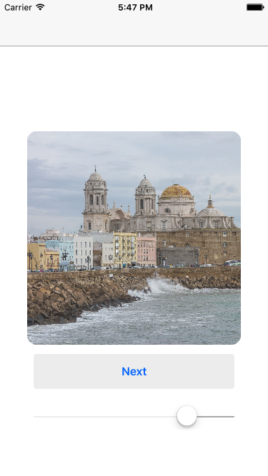

## GrandStream
**GrandStream** is a small iOS application that uses Grand Central Dispatch (GCD) to fetch images from a URL using the background thread avaialable in iOS devices. Here is a screeshot of the finished application:

	

If you are interested in checking out an step-by-step tutorial on how to build this aplication, please check out this [link](https://medium.com/@nsuarez.canton/networking-and-ui-updates-swift-3-44d97e4b400f).

### How to run it locally?
In oder to run the application locally, one must clone the repository to to a local machine and open `GrandStream.xcodeproj`. This will open Xcode, and the application can be run on a simulator or by plugging an iOS device. Execute the following command in order to clone the repository:
 
* `git clone git@github.com:nsuarezcanton/GrandStream.git`